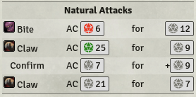

# Module for Foundry VTT

Module that provides tools for writing macros in Foundry VTT.
Build with Pathfinder 1e in mind, but some functionality will be useful for other game systems as well.

## AttackTable

Class for generating multi-attack outputs in a compact format, similar to the pf_attack template in roll20.
Provides highlighting of natural 1s and 20s, and confirmation rolls conditional on the attack roll being a threat.

### Example Usage

    let attack_bonus = 12;
    let damage = '1d12+9+2d6[sneak attack]';
    let crit = { range: 19, damage: '2d12+18' }; // 19-20/x3 critical
    let table = new AttackTable('Full Attack (Greataxe)');
    table.addAttack('1st attack', attack_bonus, damage, crit);
    table.addAttack('2nd attack', attack_bonus - 5, damage, crit);
    table.chat();

##### With Images:

    let img_bite = '';
    let img_claw = '';
    let table = new AttackTable(`Natural Attacks`);
    table.addAttack(img_bite + ' Bite', 5, '1d8+4');
    table.addAttack(img_claw + ' Claw', 5, '1d6+4');
    table.addAttack(img_claw + ' Claw', 5, '1d6+4');
    table.chat();

## InputDialog

Class to simplify creation of a dialog that collects user input.

### Example Usage

    let d = new InputDialog('Attack Bonuses', { single: 'Single Attack', full: 'Full Attack'});
    d.addInput('Attack Bonus', 'ab', 2);
    d.addInput('Damage Bonus', 'db', 0);
    d.addCheckbox('Hasted', 'hasted', false);
    d.render((data) => {
        let ab = 5 + data.ab;
        let damage = `1d10+${6 + data.db}`;
        let table = new AttackTable('Attack (Sansetsukon)');
        table.addAttack('1st attack', ab, damage);
        if (data.button != 'single') {
            table.addAttack('Flurry', ab, damage);
            if (data.hasted)
                table.addAttack('Haste', ab, damage);
        }
        table.chat();
    });
