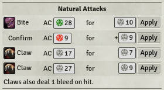
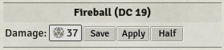

# Module for Foundry VTT

Module that provides tools for writing macros in Foundry VTT.
Build with Pathfinder 1e in mind, but some functionality will be useful for other game systems as well.

## AttackTable

Class for generating multi-attack outputs in a compact format, similar to the pf_attack template in roll20.
Provides highlighting of natural 1s and 20s, and confirmation rolls conditional on the attack roll being a threat.

### Example Usage

    let attack_bonus = 12;
    let damage = '1d12+9+2d6[sneak attack]';
    let crit = { range: 19, damage: '2d12+18' }; // 19-20/x3 critical
    let table = new AttackTable('Full Attack (Greataxe)');
    await table.addAttack('1st attack', attack_bonus, damage, crit);
    await table.addAttack('2nd attack', attack_bonus - 5, damage, crit);
    table.chat();

Damage rolls are rounded down automatically:

    let table = new AttackTable(`Empowered Scorching Ray`);
    await table.addAttack('1st ray', 10, `(4d6)*1.5`);
    await table.addAttack('2nd ray', 10, `(4d6)*1.5`);
    table.chat();

Combat maneuver checks can use `addManeuver` (damage is optional):

    let cmb = 13;
    let damage = '1d6+4'
    let table = new AttackTable('Grapple');
    await table.addManeuver('', cmb, damage);
    table.chat();

##### With Images and Note:

    let img_bite = '';
    let img_claw = '';
    let table = new AttackTable(`Natural Attacks`);
    await table.addAttack(img_bite + ' Bite', 8, '1d8+4');
    await table.addAttack(img_claw + ' Claw', 8, '1d6+4');
    await table.addAttack(img_claw + ' Claw', 8, '1d6+4');
    table.addNote('Claws also deal 1 bleed on hit.');
    table.chat();

##### Healing and Half Damage:

The function `damageRollAndButton` can be used to add custom damage or healing rolls, for use within notes.

    let table = new AttackTable('Lay on Hands');
    table.addNote('Healing ' + await AttackTable.damageRollAndButton("1d6", {heal: true}));
    table.chat();

    let table = new AttackTable('Fireball');
    table.addNote('Damage: ' + await AttackTable.damageRollAndButton("10d6", {half: true}));
    table.addSavingThrow('ref', 'Reflex Save DC 19 for half');
    table.chat();

## InputDialog

Class to simplify creation of a dialog that collects user input.

### Example Usage

    let d = new InputDialog('Attack Bonuses', { single: 'Single Attack', full: 'Full Attack' });
    d.addInput('Attack Bonus', 'ab', 2);
    d.addInput('Damage Bonus', 'db', 0);
    d.addCheckbox('Hasted', 'hasted', false);
    d.render(async (data) => {
        let ab = 5 + data.ab;
        let damage = `1d10+${6 + data.db}`;
        let table = new AttackTable('Attack (Sansetsukon)');
        await table.addAttack('1st attack', ab, damage);
        if (data.button != 'single') {
            await table.addAttack('Flurry', ab, damage);
            if (data.hasted)
                await table.addAttack('Haste', ab, damage);
        }
        table.chat();
    });
